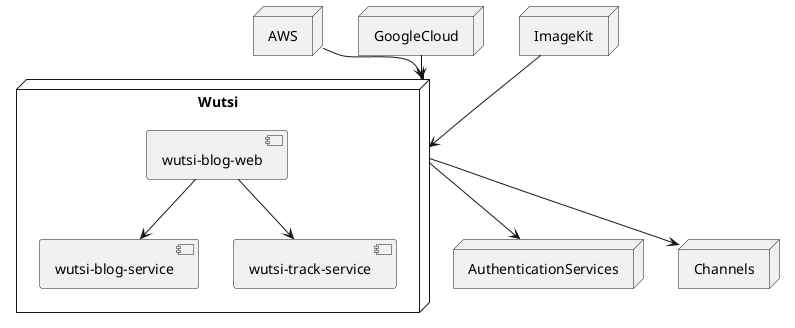

# High Level Architecture

```plantuml
@startuml

node Wutsi {
    [wutsi-blog-web] 
    [wutsi-blog-service]
    [wutsi-track-service]
}

node AWS
node AuthenticationServices
node GoogleCloud
node ImageKit
node Channels


GoogleCloud --> Wutsi 
AWS --> Wutsi
Wutsi --> AuthenticationServices
Wutsi --> Channels
ImageKit --> Wutsi

[wutsi-blog-web] --> [wutsi-blog-service]
[wutsi-blog-web] --> [wutsi-track-service]

@enduml
```

# Components
- [wutsi-blog-web](wutsi-blog-web)
- [wutsi-blog-service](wutsi-blog-service)
- [wutsi-track-service](wutsi-track-service)
