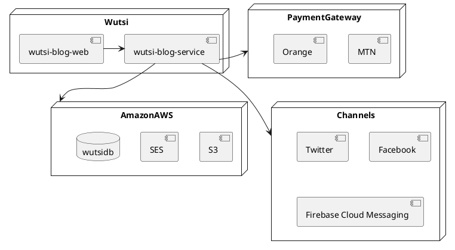

```plantuml
@startuml

node Wutsi {
    [wutsi-blog-web] 
    [wutsi-blog-service]
}

node AmazonAWS {
    [S3]
    [SES]
    database wutsidb{
    }
}

node Channels {
    [Twitter]
    [Facebook]
    [Firebase Cloud Messaging]
}

node PaymentGateway {
    [MTN]
    [Orange]
}


[wutsi-blog-web] -> [wutsi-blog-service]
[wutsi-blog-service] --> Channels
[wutsi-blog-service] --> AmazonAWS
[wutsi-blog-service] -> PaymentGateway


@enduml
```

# Designs
- [Publish to Channel](publish-to-channel.md)
- [Like](like.md)
- [Statistics](statistics.md)
