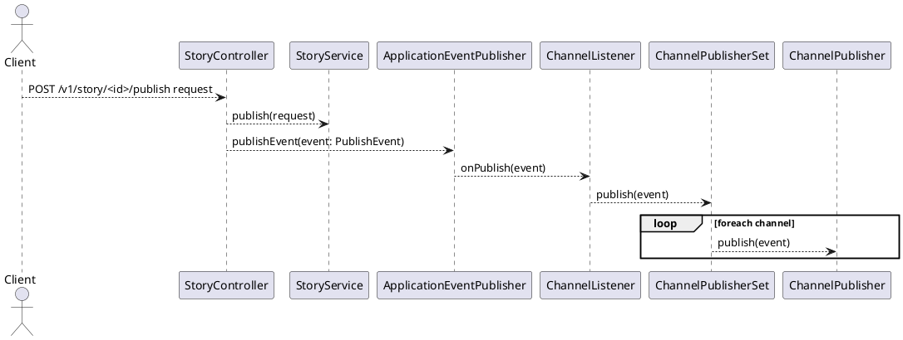
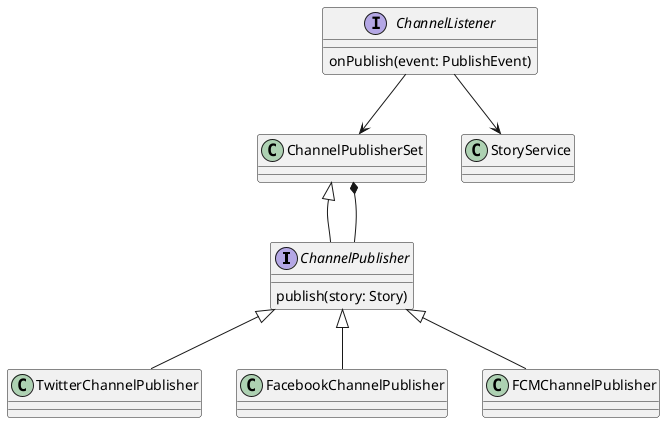

# Publishing Stories To Channels
When authors publish stories, the story is published to website so that reader can start reading.
In parallel, the stories are publish to other channels to reach other users.
The channel supported by Wutsi
 - [Twitter](https://github.com/WutsiTeam/wutsi-blog-service/blob/master/src/main/kotlin/com/wutsi/blog/channel/service/twitter/TwitterChannelPublisher.kt)
 - [Facebook](https://github.com/WutsiTeam/wutsi-blog-service/blob/master/src/main/kotlin/com/wutsi/blog/channel/service/facebook/FacebookChannelPublisher.kt)

## Sequence Diagram

## Channel Class Diagram

