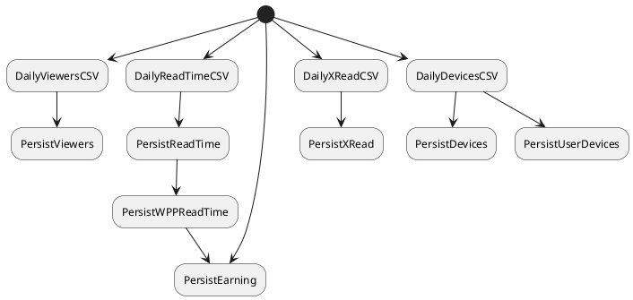

# Wusti Statistics Pipeline

- DailyViewersCSV: This process generates the [daily viewer file](https://github.com/wutsi/wutsi-stats/wiki/Viewers).
- PersistViewers: This process persists information from the daily viewer file into the database.
- DailyReadTimeCSV: This process generates the daily read-time file.
- PersistReadTime: This process persists information from the daily read-time file into the database.
- DailyXReadCSV: This process generates the daily xread file. XRead identify when user select a recommended articles from the reader.
- PersistXRead: This process persists information from the daily xread file into the database.

