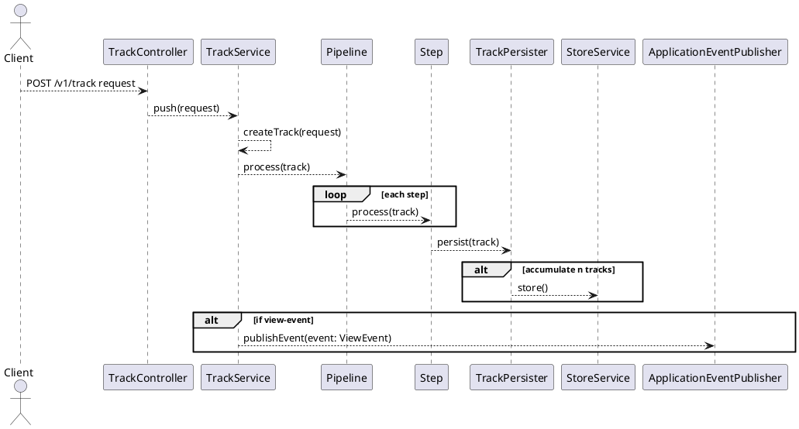

The Tracking API is used to collecting all users events and store them into CSV files.
Those files are later analyse for extracting valuable statistics.

# Sequence Diagram

```plantuml
@startuml

Actor Client

Client --> TrackController: POST /v1/track request
TrackController --> TrackService: push(request)
TrackService --> TrackService: createTrack(request)
TrackService --> Pipeline: process(track)

loop each step
  Pipeline --> Step: process(track)
end loop

Step --> TrackPersister: persist(track)

alt accumulate n tracks
  TrackPersister --> StoreService: store()
end alt

alt if view-event
  TrackService --> ApplicationEventPublisher: publishEvent(event: ViewEvent)
end alt

@enduml
```
