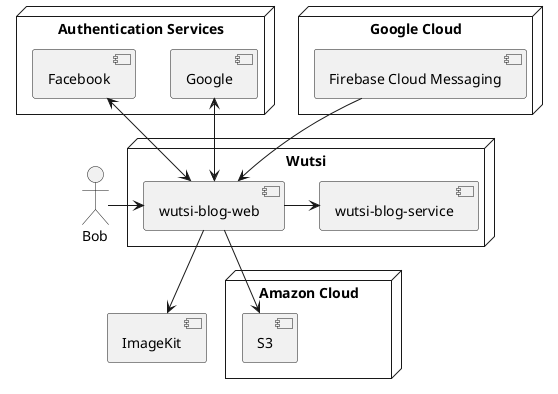

# wutsi-blog-web

```plantuml
@startuml

Actor Bob
node Wutsi {
    [wutsi-blog-web] 
    [wutsi-blog-service]
}

node "Amazon Cloud" {
    [S3]
}

node "Authentication Services" {
    [Google]
    [Facebook]
}

node "Google Cloud" {
    [Firebase Cloud Messaging]
}


[Firebase Cloud Messaging] --> [wutsi-blog-web] 
[Google] <--> [wutsi-blog-web]
[Facebook] <--> [wutsi-blog-web]

Bob -> [wutsi-blog-web]
[wutsi-blog-web] -> [wutsi-blog-service]
[wutsi-blog-web] --> [ImageKit]
[wutsi-blog-web] --> [S3]

@enduml
```
