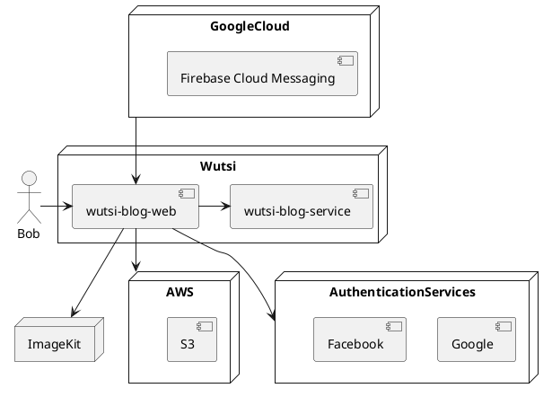

# wutsi-blog-web

```plantuml
@startuml

Actor Bob
node Wutsi {
    [wutsi-blog-web] 
    [wutsi-blog-service]
}

node AWS {
    [S3]
}

node AuthenticationServices {
    [Google]
    [Facebook]
}

node GoogleCloud {
    [Firebase Cloud Messaging]
}

node ImageKit


GoogleCloud --> [wutsi-blog-web] 
[wutsi-blog-web] --> AuthenticationServices

Bob -> [wutsi-blog-web]
[wutsi-blog-web] -> [wutsi-blog-service]
[wutsi-blog-web] --> ImageKit
[wutsi-blog-web] --> AWS

@enduml
```
