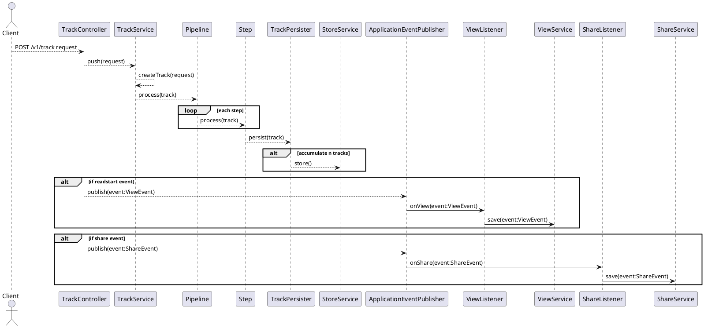

The Track service is handling all user tracking events.

# Sequence Diagram

# Tracking File
``StoreService`` is storing all the tracking information to a CSV file having the following format:

- **time**: date/time in millisecond when the event was occured.
- **hitid**: ID assigned to each visit on a page.
- **deviceid**: ID of the device (phone, browser) that fired the event.
- **userid**: ID of the user who fired the event. This information is provided if user is logged in
- **page**: Name of the page where the event was fired.
- **event**: Name of the event fired. See details [here](https://github.com/wutsi/wutsi.github.io/blob/master/design/kpi/Tracking%20File.md#event)
- **productid**: ID of the product associated with the event
- **value**: Value attached with the event.
- **os**: Name of the Operating System of the device that fired the event
- **osversion**: Version of the Operating System of the device that fired the event
- **devicetype**: Type of device: `mobile` or `desktop`
- **browser**: Type of browser
- **ip**: IP of the device that fired the event
- **long**: Longitude  where the event was fired
- **lat**: Latitude where the event was fired
- **traffic**: Source of the traffic.
- **referer**: URL of the referer page
- **bot**: `true` if this event was fired by a bot
- **ua**: User Agent
- **url**: URL where the event was sent

# Events
Here is the list of events:
- **readstart**: User starts reading an article. This event is fired when user enters the page `/read/...`.
- **readend**: User stops reading an article. This event is fired when user leave the page `/read/...`.
- **scroll**: User scrolls up/down when reading an article.
- **xread**: User clicks on article recommendation after reading an article.
- **share-facebook**: User shares and article on Facebook.
- **share-messenger**: User shares and article on Messenger.
- **share-twitter**: User shares and article on Twitter.
- **share-whatsapp**: User shares and article on WhatsApp.
- **login**: User logged in.
- **g_one_tap_show**: Google One-Tap popup opened.
- **pwa_a2hs_show**: The `Add To Homescreen` panel has been displayed
- **pwa_a2hs_install**: User has installed the PWA version of the application.
- **pwa_push_show**: The push notification panel has been displayed
- **pwa_push_install**: User has enabled push notification
- **comment_click**: User click on comment button
- **comment**: User submit a comment
- **like_click**: User click on like button
- **lile**: User submit a like

# Traffic
The Traffic indicate from where the user if comming from
- **direct**: Direct traffic. User entered URL of webpage straight in browser.
- **social_media**: User is coming from social media, by clicking a link of an article showing on Social Media.
- **email**: User coming from email, by clicking a link of an article contained in an email.
- **seo**: User coming from Google/Bing etc.

# Links
- [Statistics](statistics.md)
