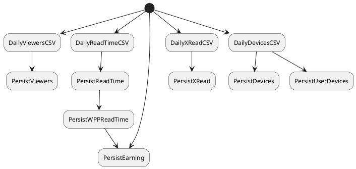

# Wusti Statistics Pipeline

- DailyViewersCSV: This process generates the [daily viewer CSV file](https://github.com/wutsi/wutsi-stats/wiki/Viewers).
- PersistViewers: This process transfer the daily viewer CSV file into the database.
- DailyReadTimeCSV: This process generates the daily read-time CSV file. The file contains the total duration time per story.
- PersistReadTime: This process transfer the daily read-time CSV file into the database.
- PersistWPPReadTime: This process compute the readtime for all monetized stories and store it into the DB.
- PersistEarning: This process compute earnings per user.
- DailyXReadCSV: This process generates the daily xread CSV file. XRead identify when user select a recommended articles from the reader.
- PersistXRead: This process transfer the daily xread CSV file into the database.
- DailyDevicesCSV: This process generates the [device CSV file](https://github.com/wutsi/wutsi-stats/wiki/Devices).
- PersistDevices: This process transfer the daily device CSV file into the database.
- PersistUserDevices: This process store into the database the association between users and their device.

