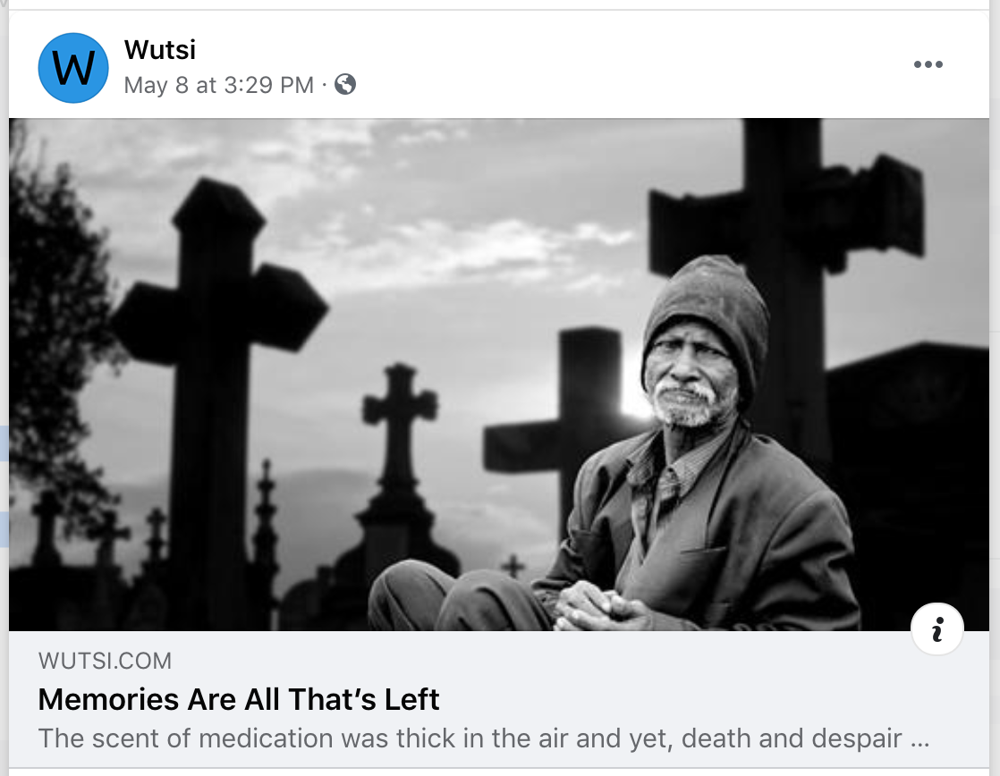
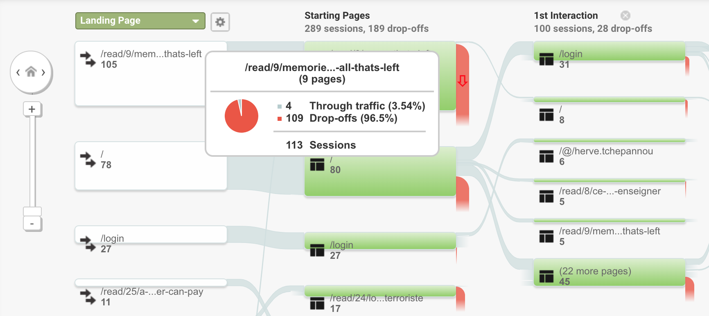
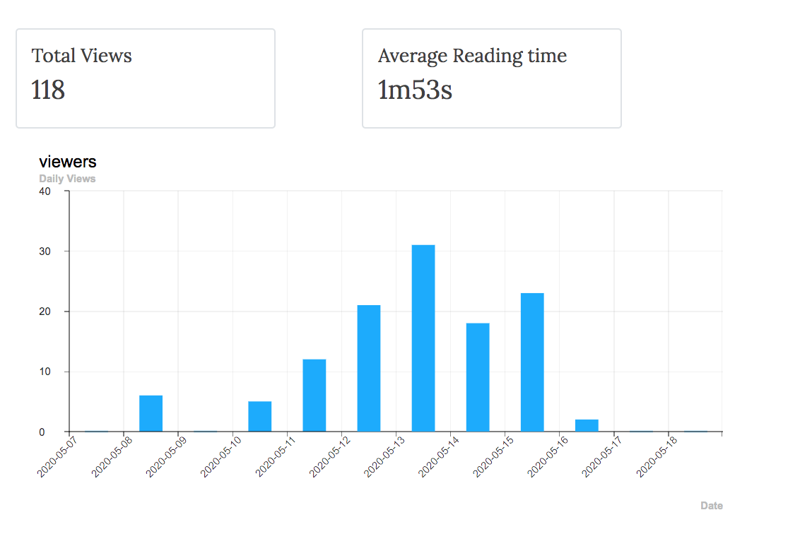

Campain to promote a story via Facebook

- [Trello Card](https://trello.com/c/dJlEaTi5/1-promote-1-article-every-week-via-facebook-ads)
- [Facebook Campain](https://www.facebook.com/ad_center/manage?boost_id=3138240423067836&entry_point=www_ad_center_overview_ad_cards)

# Test Information
- Start Date: May 11, 2020
- Duration Of Test: 7d

# User Expedience
| Facebook | Landing Page |
|----------|--------------|
|  | [Story](https://www.wutsi.com/read/9) |

# Results
- Impressions: 22546
- Clicks: 206
- Number of FB Fans: 11

- Campain Costs: $...
- Cost Per Click: **$0.08**
- CTR: **0.9%**
- Subscription CVR: **0.0%**
- Fan CVR: **0.04%**

# Learnings
### User drop from the site after reading the articles. 
**96%** drop off from the site after reading the article. We see similar pattern in other pages

We should recommend to user what to read next, instead of expecting them to go back to homepage to search for next article.

### Facebook Campain effective, but very costly!

- Views by **400%** (from 5 daily views to 21 in average) after May 11, 2020.
- Facebook fans increased by **500%** from 2 to 11. **IMPORTANT** To get people Likes on the page, its important to track who interact with the ads, and invite them to Like the page!
Although the percentage are impressive, the absolute number are relativelly low - Every click costs **$0.08** 

### Few shares
- No share in the reader
- 1 share in Facebook
 
### No user interacted with Google One-Tap popup to login
- No login via Google One-Tap popup

# Oportunities
- Recommend to user next article to read, from the reader so that they continue reading other articles.
- Force user to login before reading articles
